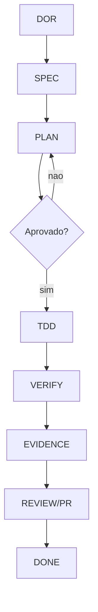
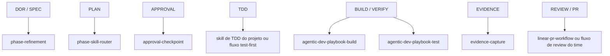
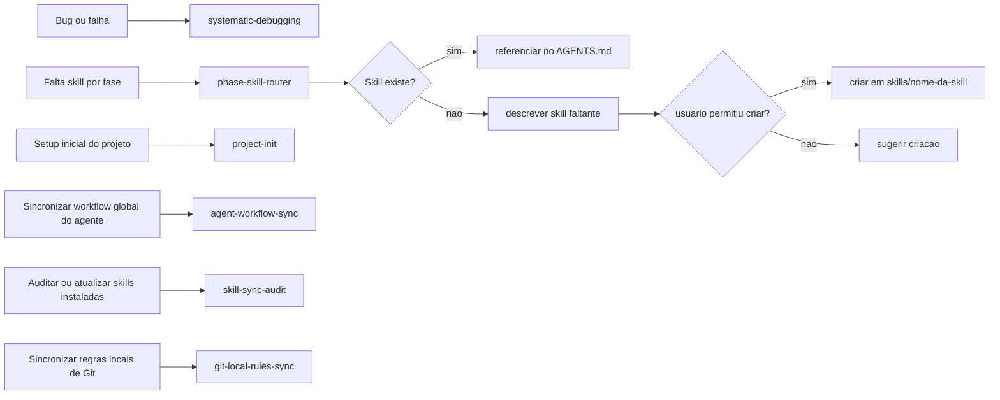

# Workflow Flowchart

Este documento descreve o workflow padrão do projeto, as regras operacionais e as skills recomendadas em cada fase.

## Regra Padrão

```text
DOR -> SPEC -> PLAN -> APPROVAL -> TDD -> VERIFY -> EVIDENCE -> REVIEW/PR -> DONE
```

Regras base:

- não pular fases
- registrar decisões em `docs/decisions/[WORK-ID].md`
- confirmar aprovação antes de implementar
- validar build/test antes de concluir
- capturar evidências antes de declarar a entrega pronta

## Fluxograma Geral



## Fases e Skills



## Fluxos Transversais



## Leitura Operacional

1. Refinar a demanda em `DOR` e `SPEC`.
2. Planejar a implementação em `PLAN`.
3. Parar no checkpoint de aprovação.
4. Implementar com disciplina test-first.
5. Validar com build, testes e verificações necessárias.
6. Capturar evidências.
7. Encaminhar para review ou PR.
8. Concluir somente depois da validação e do registro de evidências.

## Observações

- `phase-skill-router` decide se já existe skill adequada para uma fase ou situação transversal.
- Se a skill não existir, ela deve ser descrita e só criada com permissão do usuário.
- `agent-workflow-sync` e `skill-sync-audit` são agent-aware: atuam sobre o agente em uso ou sobre o agente explicitamente informado.
