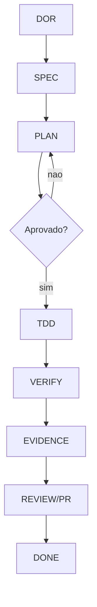
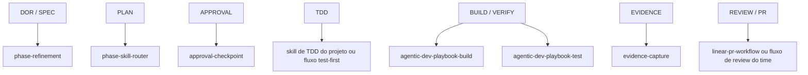
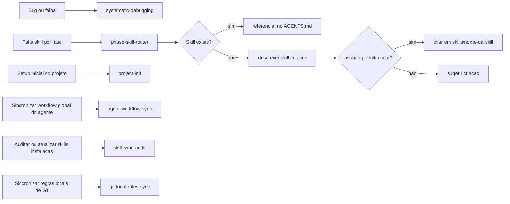

# Workflow Flowchart

Este documento descreve o workflow padrão do projeto, as regras operacionais e as skills recomendadas em cada fase.

## Regra Padrão

```text
DOR -> SPEC -> PLAN -> APPROVAL -> TDD -> VERIFY -> EVIDENCE -> REVIEW/PR -> DONE
```

Regras base:

- não pular fases
- registrar decisões em `docs/decisions/[WORK-ID].md`
- confirmar aprovação antes de implementar
- validar build/test antes de concluir
- capturar evidências antes de declarar a entrega pronta

## Fluxograma Geral



## Detalhamento de Cada Caixa

### DOR

O objetivo de `DOR` é verificar se a demanda está pronta para entrar em execução.

O que fazer:

- confirmar a intenção da tarefa
- levantar requisitos de negócio
- identificar requisitos funcionais e não funcionais
- verificar se existem critérios de aceite testáveis

Exemplo:

- pedido inicial: "precisamos melhorar o cadastro"
- saída esperada de `DOR`: "o usuário deve conseguir salvar cadastro sem recarregar a página, com validação de e-mail e mensagem de sucesso"

### SPEC

O objetivo de `SPEC` é transformar a demanda refinada em uma especificação explícita.

O que fazer:

- documentar contexto
- listar requisitos
- registrar critérios de aceite
- marcar fora de escopo

Exemplo:

- `FR01`: permitir cadastro com nome, e-mail e senha
- `NFR01`: resposta da API em menos de 500ms no cenário padrão
- `AC01`: dado e-mail inválido, quando enviar o formulário, então exibir erro sem salvar

### PLAN

O objetivo de `PLAN` é definir a ordem de implementação e reduzir improviso.

O que fazer:

- quebrar a entrega em passos
- definir dependências
- identificar riscos
- decidir a sequência de testes e implementação

Exemplo:

1. criar teste do endpoint de cadastro
2. implementar validação de e-mail
3. implementar persistência
4. criar teste de interface
5. capturar evidências

### APPROVAL

O objetivo de `APPROVAL` é garantir que o planejamento foi revisado antes da implementação.

O que fazer:

- resumir `spec.md`
- resumir `prompt_plan.md`
- expor riscos e trade-offs
- pedir autorização explícita para seguir

Exemplo:

- "O planejamento está pronto. Posso começar a implementação?"

### TDD

O objetivo de `TDD` é implementar a mudança guiado por testes.

O que fazer:

- escrever o teste que falha
- implementar o mínimo para passar
- refatorar sem quebrar o comportamento

Exemplo:

- criar teste que espera `400` para e-mail inválido
- implementar validação no backend
- refatorar extraindo a validação para um serviço reutilizável

### VERIFY

O objetivo de `VERIFY` é provar que a solução funciona tecnicamente.

O que fazer:

- rodar testes
- rodar build
- validar critérios de aceite
- executar checagens manuais quando necessário

Exemplo:

- `./scripts/validate_repo.sh`
- `npm test`
- `./gradlew build`

### EVIDENCE

O objetivo de `EVIDENCE` é registrar o que comprova que a entrega está correta.

O que fazer:

- salvar outputs relevantes
- documentar o comportamento esperado
- registrar passos de validação humana
- listar limitações ou riscos aceitos

Exemplo:

- log de teste passando
- screenshot da interface atualizada
- passo a passo: "acesse /signup, preencha dados válidos, confirme mensagem de sucesso"

### REVIEW/PR

O objetivo de `REVIEW/PR` é encaminhar a mudança para revisão formal ou validação externa.

O que fazer:

- abrir PR ou artefato de review
- anexar evidências
- explicar como validar
- relacionar a issue, quando existir

Exemplo:

- título: `feat: cadastro com validação de e-mail`
- corpo: resumo da mudança, testes executados e como validar

### DONE

O objetivo de `DONE` é encerrar a tarefa com rastreabilidade.

O que fazer:

- confirmar que a revisão terminou
- garantir que evidências ficaram registradas
- deixar o log de decisões atualizado

Exemplo:

- PR mergeada
- issue movida para concluída
- decisão final registrada em `docs/decisions/[WORK-ID].md`

## Fases e Skills



## Fluxos Transversais



## Leitura Operacional

1. Refinar a demanda em `DOR` e `SPEC`.
2. Planejar a implementação em `PLAN`.
3. Parar no checkpoint de aprovação.
4. Implementar com disciplina test-first.
5. Validar com build, testes e verificações necessárias.
6. Capturar evidências.
7. Encaminhar para review ou PR.
8. Concluir somente depois da validação e do registro de evidências.

## Observações

- `phase-skill-router` decide se já existe skill adequada para uma fase ou situação transversal.
- Se a skill não existir, ela deve ser descrita e só criada com permissão do usuário.
- `agent-workflow-sync` e `skill-sync-audit` são agent-aware: atuam sobre o agente em uso ou sobre o agente explicitamente informado.
